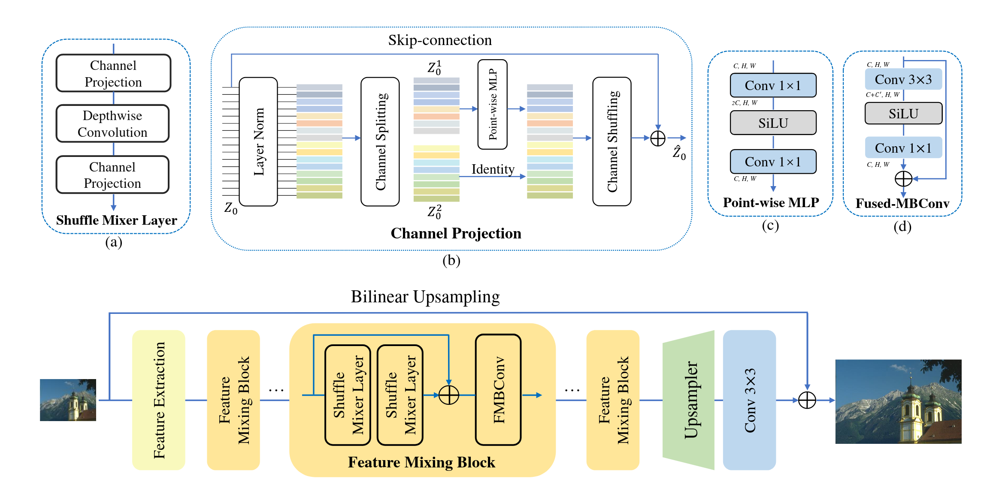

# COMP6258 Reproducability Challenge: ShuffleMixer

Jos-Elliot Jeapes (jej1g19) & Samsom Yebio (sy1c20)

This reproducibility report focuses on [ShuffleMixer: An Efficient ConvNet for Image Super-Resolution](https://arxiv.org/abs/2205.15175).

 *ShuffleMixer architecture.*

## Files

### Implementation

The *shuffle_mixer* folder contains the model implementation, custom data loader, and training code (with a separate file each).

In the root folder, *downsample.py* and *rename.py* were used for preprocessing, as discussed in the report, and *main.py* is for training the model. *test_data.py* was used to create the images in the report appendix (except the pretrained output).

As usual, *requirements.txt* lists the required python libraries. A python 3.10 virtual environment was used.

Iridis was not used in the end, but the shell scripts were for calling the above python on Iridis. It is probably better to use the Iridis forums as a reference, but the shell scripts in the repository work as examples.

The final checkpoint is provided, *350000.ckpt*.

### Report

*main.pdf* is the final report, with *main.tex* and  *main.bib* existing as examples of report writing in LaTeX.

Everything in *test_output* was generated for the report appendix. 

*pavement.png* and *block diagram.png* are both screenshots of the original paper, used in the report.

*iclr2022* is the [ICLR](https://iclr.cc/) style folder and the images in *test_data* are from the datsets [Kitti](https://www.cvlibs.net/datasets/kitti/) and [Celeb A HQ](https://mmlab.ie.cuhk.edu.hk/projects/CelebA.html). These are included in the repo solely because they are required for the report to compile.

### Running the Pretrained ShuffleMixer

[The ShuffleMixer Github Repository](https://github.com/sunny2109/ShuffleMixer) contains instructions on installing prerequisites, links to pretrained models, and everything else needed to test the pretrained ShuffleMixer model.

*test_x4.yml* is a config for use with this repository, though it only serves as an example - the referenced folders and files do not exist in this repository. It was used to create images for the report appendix.

### Missing Folders

The training writes to two folders, both subfolders of output:
- *checkpoints* which, unsurprisingly, stores the model checkpoints,
- *tensorboard* which is the tensorboard log, containing loss curves and examples generated at set intervals.

The training uses data from *data/train/original*, *data/train/four* (or two), and the same with valid in place of train. Start with the *original* folder in both, containing the relevant DIV2K and Flickr2K images. Then, run *rename.py* followed by *downsample.py* as shown in *prep.sh*. The *four* and *two* folders will be created, containing the 4x and 2x downsampled images respectively.